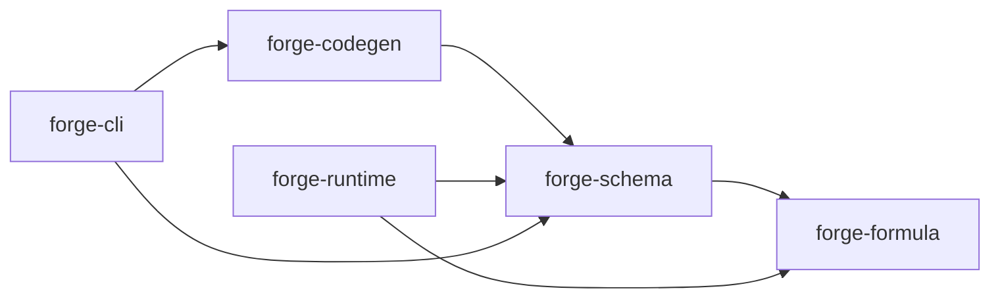
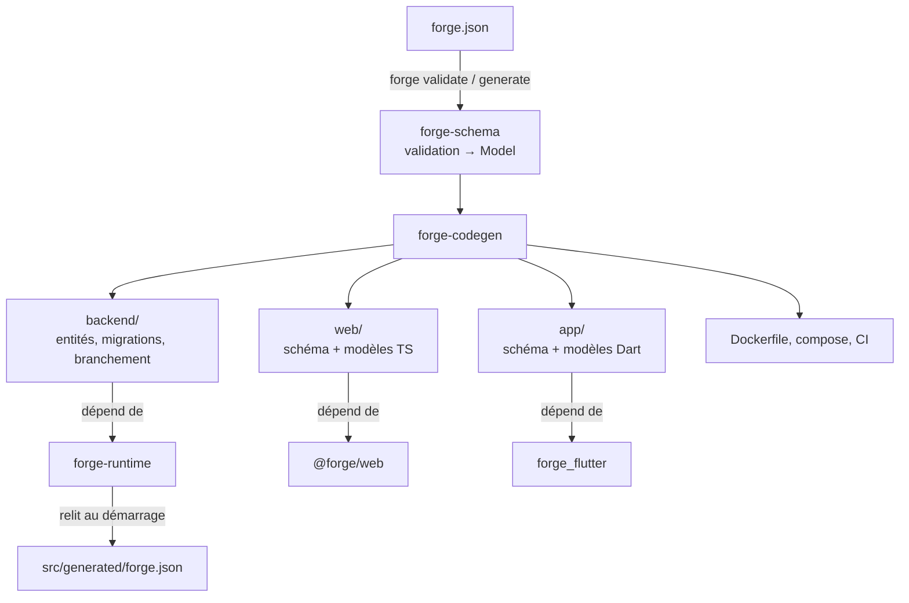

# 1. Vue d'ensemble

## Le principe

forge transforme **un fichier de description**, `forge.json` (tables, colonnes,
formules, règles d'accès, vues), en **une application complète** :

- un backend Rust (API REST, GraphQL, OpenAPI, authentification, migrations) ;
- une interface web React et/ou une application Flutter (web, Android, iOS) ;
- l'infrastructure : Dockerfile, docker-compose, CI GitHub.

L'idée directrice : **le code généré est mince, la logique vit dans des
bibliothèques**. Le générateur écrit seulement ce qui doit être typé (entités
de base de données, modèles Dart/TypeScript, migrations) et le branchement.
Tout le reste (validation, droits, formules, écrans…) est dans trois
bibliothèques que l'application générée importe :

| Bibliothèque | Langage | Rôle |
|---|---|---|
| `forge-runtime` | Rust | tout le comportement du backend |
| `@forge/web` | TypeScript / React | tous les écrans de l'interface web |
| `forge_flutter` | Dart / Flutter | tous les écrans de l'application Flutter |

Conséquence pratique : corriger un bug ou ajouter une fonction dans une
bibliothèque profite à toutes les applications **sans les régénérer**.

## Les briques du dépôt

```text
crates/
├── forge-formula/   langage de formules (aucune connaissance du schéma)
├── forge-schema/    lecture et validation de forge.json → Model
├── forge-codegen/   génération des fichiers d'un projet
├── forge-runtime/   bibliothèque du backend généré
└── forge-cli/       binaire `forge`
packages/
├── forge_web/       bibliothèque de l'interface web (@forge/web)
└── forge_flutter/   bibliothèque de l'application Flutter
templates/           templates minijinja (backend/, web/, flutter/, infra/)
examples/crm/        projet de référence, entièrement généré puis personnalisé
scripts/             scénario de bout en bout (évolution d'un schéma)
docs/                cette documentation
```

Dépendances entre crates :



`forge-schema` est le point commun : le générateur **et** le runtime lisent le
même `forge.json` avec le même code, donc ne peuvent pas diverger.

## Du `forge.json` à l'application



1. **Validation** (`forge-schema`) : le JSON est désérialisé, puis vérifié
   (noms, références, formules, règles…). Le résultat est un `Model` : le
   schéma avec ses relations résolues et ses formules déjà analysées.
2. **Génération** (`forge-codegen`) : à partir du `Model`, écriture des
   fichiers du projet. Une migration n'est créée que si la structure de la base
   a changé.
3. **Exécution** : le backend généré embarque une **copie** de `forge.json`.
   Au démarrage, `forge-runtime` la relit, la valide et en tire tout son
   comportement. Les interfaces, elles, reçoivent la description des tables
   sous forme de code (`schema.ts`, `schema.dart`).

## Ce qui est généré, ce qui vous appartient

Chaque projet mélange du code réécrit par forge et du code à vous, dans des
dossiers séparés :

| Dossier | Statut |
|---|---|
| `backend/src/generated/`, `web/src/generated/`, `app/lib/generated/` | **réécrits** à chaque `forge generate` (ne pas modifier) |
| `backend/src/custom/`, `web/src/custom/`, `app/lib/custom/` | **à vous**, créés une fois, jamais modifiés |
| `backend/src/migrations/` | créées une fois chacune, jamais réécrites |
| points d'entrée et manifestes (`main.rs`, `Cargo.toml`, `package.json`, `pubspec.yaml`…) | créés une fois |

Le code généré **importe** le code personnalisé (et pas l'inverse) : ajouter une
table ne touche donc aucun fichier à vous. Détails dans
[Génération](03-generation.md#régénération-sans-perte).

## Le projet d'exemple

`examples/crm` est un mini-CRM (entreprises, contacts, opportunités, activités,
étiquettes) **généré par forge** puis personnalisé (hooks, fonction de
formule, route, sections de fiche). Il sert à la fois de démonstration, de
documentation par l'exemple et de test : la CI vérifie qu'il correspond
exactement à ce que produit le générateur, compile son backend, lance ses tests
(SQLite, PostgreSQL, MySQL) et construit son image Docker.

Suite : [2. Schéma et formules](02-schema-et-formules.md).
