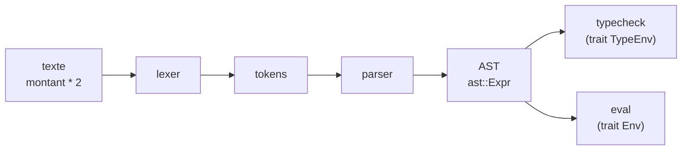
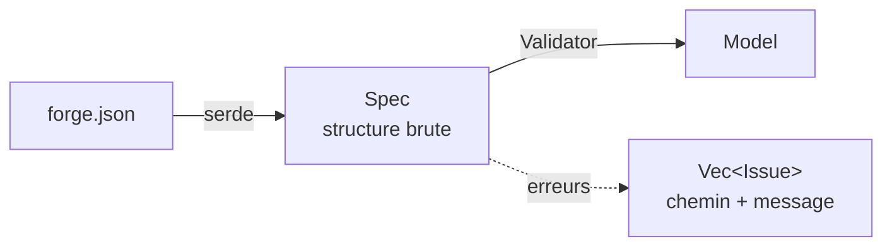

# 2. Schéma et formules

Deux crates sans aucune dépendance au web ni à la base de données :
`forge-formula` (le langage de formules) et `forge-schema` (le format
`forge.json`). Elles sont utilisées à la fois par le générateur et par le
runtime.

## `forge-formula` : le langage de formules

Une colonne calculée s'écrit `"formula": "montant * probabilite / 100"`. La
crate traite ces expressions en quatre étapes classiques, chacune dans son
module :



| Module | Rôle |
|---|---|
| `lexer` | découpe le texte en jetons (nombres, textes, identifiants, opérateurs, `$param.x`, `$user.id`) |
| `parser` | construit l'arbre `ast::Expr` (priorités des opérateurs, appels de fonction, chemins `entreprise.secteur`) |
| `typecheck` | calcule le type d'une expression et refuse les incohérences (`texte * 2`) |
| `eval` | calcule la valeur, avec la sémantique NULL des bases de données (`NULL + 1 = NULL`) |
| `functions` | `FunctionRegistry` : signatures et implémentations des fonctions |

Le point clé est que la crate **ne connaît pas le schéma**. Elle demande ce
qu'elle ignore à travers deux traits :

- `TypeEnv` : « quel est le type de `entreprise.secteur` ? » (implémenté par
  `forge-schema` pendant la validation) ;
- `Env` : « quelle est la valeur de `montant` pour cette ligne ? » (implémenté
  par `forge-runtime` au moment du calcul).

Ce découplage permet de tester le langage seul, et de le réutiliser ailleurs.

**Fonctions.** `FunctionRegistry::builtin()` contient `IF`, `ROUND`, `CONCAT`,
`TODAY`, `DAYS_BETWEEN` et les agrégats `SUM`, `AVG`, `MIN`, `MAX`, `COUNT`. Une
signature décrit l'arité, les types, si c'est un agrégat (argument = chemin
vers une relation « plusieurs », ex. `SUM(opportunites.montant)`) et si elle
est **volatile** (`TODAY` : résultat qui change avec le temps, donc interdite
dans une formule stockée en base). Les fonctions personnalisées d'un projet
sont déclarées dans `forge.json` (`functions`) puis implémentées en Rust ;
`missing_implementations()` permet au runtime de refuser de démarrer s'il en
manque une.

## `forge-schema` : le format `forge.json`

### Les modules

| Module | Rôle |
|---|---|
| `spec` | les types Rust du fichier (serde), avec `deny_unknown_fields` : une faute de frappe dans une clé est une erreur. C'est aussi la source du JSON Schema (`forge schema > forge.schema.json`) qui donne l'autocomplétion dans l'éditeur |
| `validate` | la validation sémantique, qui produit le `Model` |
| `model` | `Model` : le schéma validé et enrichi |
| `value` | conversion JSON ou texte (CSV, URL) → `TypedValue`, avec les contraintes de la colonne |
| `graph` | tri topologique et détection de cycles |
| `names` | règles des identifiants, mots réservés de Rust et Dart |
| `graphql` | noms GraphQL dérivés des tables, détection de conflits |

### De `Spec` à `Model`



`Model::from_json` enchaîne les deux étapes. Le `Model` contient, en plus du
`Spec` d'origine :

- les **relations résolues** (`relations()`) : chaque `reference` ou
  `reference_list` avec sa cible, son inverse éventuel et sa table de jointure ;
- les **formules et conditions déjà analysées** (`formula()`, `condition()`) :
  le runtime n'a jamais à reparser du texte ;
- les **dépendances** de chaque colonne calculée (`dependencies()`) et l'**ordre
  de calcul** (`computed_order()`, tri topologique : une formule qui en lit une
  autre est calculée après elle) ;
- le **registre de fonctions** complet (intégrées + déclarées).

### Comment la validation est écrite

Le `Validator` parcourt tout le schéma et **collecte** les erreurs au lieu de
s'arrêter à la première : l'utilisateur voit tout ce qui ne va pas en une fois.
Chaque `Issue` porte un chemin JSON précis :

```text
tables[2].columns[4].formula : colonne inconnue `montnat` (position 1)
```

Deux règles évitent les messages en cascade :

- une erreur qui découle d'une erreur déjà signalée n'est pas répétée (la
  résolution d'un nom renvoie `Err(None)` dans ce cas) ;
- le typage des formules ne s'exécute que si le reste du schéma est valide.

### Les types de colonnes

`spec::ColumnType` liste tous les types. Les **modèles de champ** (`email`,
`money`, `image`…) reposent sur un **type de base** donné par `base()` :

| Modèle | Type de base |
|---|---|
| `color`, `email`, `url`, `phone`, `file`, `image` | `string` |
| `markdown` | `text` |
| `rating` | `integer` |
| `percent`, `money` | `decimal` |

Le stockage, les filtres, les formules et les conversions ne connaissent que
les types de base ; un modèle n'ajoute qu'une validation (dans `value`) et une
présentation (dans les interfaces). C'est pourquoi changer `string` en `email`
ne crée pas de migration.

### `value` : une seule conversion pour tout le monde

`value::from_json` et `value::from_text` transforment une valeur reçue (corps
JSON, cellule CSV, paramètre d'URL) en `TypedValue`, en appliquant les
contraintes de la colonne (`Domain` : valeurs d'enum, note maximale, format
d'e-mail…). Le runtime utilise ces fonctions pour les corps de requête, les
filtres, l'import CSV et les paramètres : **une valeur est validée de la même
façon quel que soit le chemin par lequel elle arrive**.

Suite : [3. Génération](03-generation.md).
