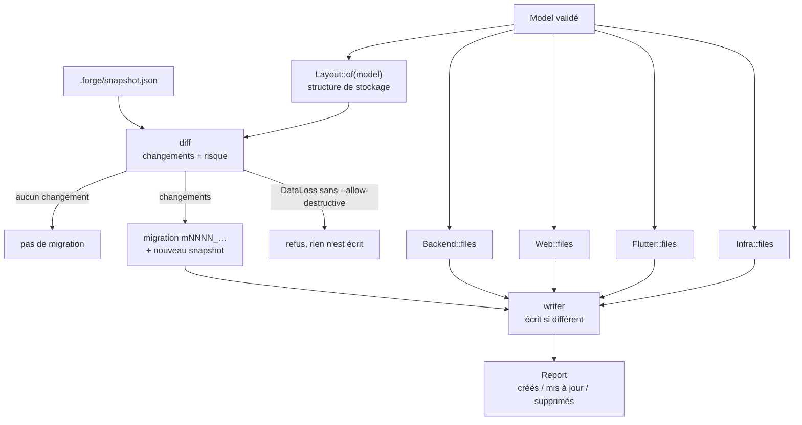

# 3. Génération : `forge-codegen` et `forge-cli`

## Le binaire `forge`

`crates/forge-cli` est volontairement mince : il lit les arguments (clap),
charge et valide `forge.json`, puis appelle `forge_codegen::generate` et
affiche le rapport.

| Commande | Effet |
|---|---|
| `forge new <dossier> --schema forge.json` | crée un projet (première génération) |
| `forge generate --dir <projet>` | met le projet à jour après une modification de `forge.json` |
| `forge validate forge.json` | valide sans rien écrire (toutes les erreurs, avec leur chemin) |
| `forge migrate up\|down\|status` | applique les migrations (délègue au binaire du backend) |
| `forge schema` | imprime le JSON Schema du format |

`forge generate` calcule aussi les **chemins vers les bibliothèques**
(`forge-runtime`, `@forge/web`, `forge_flutter`), relatifs au projet, et les
écrit dans `Cargo.toml`, `package.json` et `pubspec.yaml`.

## Le déroulé d'une génération

`forge_codegen::generate(projet, source, model, options)` (`lib.rs`) :



1. **Layout** : ce que la base doit contenir (tables, colonnes, type de
   stockage, nullabilité, unicité, clés étrangères, tables de jointure). Les
   colonnes calculées non stockées n'y figurent pas.
2. **Diff** avec le layout de la dernière migration (`.forge/snapshot.json`).
   Chaque changement a un **risque** : `Safe`, `MayFail` (ex. rendre une
   colonne obligatoire : échoue s'il existe des `NULL`) ou `DataLoss`
   (suppression, conversion). Un `DataLoss` est refusé sans
   `--allow-destructive`.
3. **Fichiers** produits par chaque générateur (backend, interfaces, infra).
4. **Écriture** par le `writer`, selon la politique de chaque fichier.

## Les générateurs

| Module | Produit | Comment |
|---|---|---|
| `backend` | `backend/` : entités sea-orm, `generated/mod.rs` (branchement), migrations, test CRUD, `custom/` initial | templates `templates/backend/` |
| `web` | `web/` : `schema.ts`, `models.ts`, `app.tsx`, test, projet Vite initial | schéma et modèles écrits en Rust, le reste par templates `templates/web/` |
| `flutter` | `app/` : `schema.dart`, `models.dart`, `app.dart`, test, projet initial | idem, templates `templates/flutter/` ; `dart` met le code en forme comme `dart format` |
| `infra` | Dockerfile, docker-compose, `.env.example`, CI GitHub, `scripts/use-forge.sh` | templates `templates/infra/`, créés une fois |
| `frontend` | ce que les deux interfaces partagent : colonne affichée d'un lookup, opérations autorisées par une règle, options des modèles de champ | — |

Les templates sont des fichiers minijinja **embarqués dans le binaire**
(`include_str!`, liste dans `render.rs`) : `forge` n'a besoin d'aucun fichier
à côté de lui. Le code Rust rendu passe par `rustfmt` s'il est installé.

Pourquoi certains fichiers sont écrits en Rust plutôt qu'en template ? Les
schémas et modèles demandent des calculs (noms qui ne doivent pas entrer en
conflit avec des mots réservés, coupure des lignes à 80 colonnes comme
`dart format`, imports réellement utilisés) qui seraient illisibles en
minijinja.

## Régénération sans perte

Le `writer` connaît deux politiques (`writer::Policy`) :

| Politique | Comportement | Exemples |
|---|---|---|
| `Generated` | réécrit à chaque fois ; supprimé s'il n'est plus produit (dans les dossiers générés) | `src/generated/**`, `web/src/generated/**`, `app/lib/generated/**`, `tests/generated_crud.rs` |
| `Once` | créé s'il n'existe pas, **jamais** modifié ensuite | `src/custom/**`, `main.rs`, `Cargo.toml`, `package.json`, migrations, Dockerfile |

Un fichier identique n'est pas réécrit : **deux générations successives ne
produisent aucun changement** (pratique avec git, et vérifié par les tests).

Le piège classique d'un générateur, c'est d'avoir à modifier un fichier
utilisateur quand le schéma change (ex. déclarer le hook d'une nouvelle
table). forge l'évite en faisant **importer le code utilisateur par le code
généré** :

```rust
// backend/src/generated/hooks.rs (généré)
#[path = "../custom/hooks/opportunite.rs"]
pub mod opportunite;
```

```rust
// backend/src/generated/mod.rs (généré) : le branchement de toute l'application
pub fn app() -> Result<forge_runtime::App, forge_runtime::Error> {
    let app = forge_runtime::App::new(SCHEMA)?
        .resource::<entities::entreprise::Entity, hooks::entreprise::EntrepriseHooks>()
        .resource::<entities::opportunite::Entity, hooks::opportunite::OpportuniteHooks>();
    let app = graphql::register(functions::register(app));
    Ok(app.routes(crate::custom::routes::routes()))
}
```

Même principe côté interfaces : `web/src/generated/app.tsx` importe
`../custom/customization`, `app/lib/generated/app.dart` importe
`../custom/customization.dart`. Le nouveau fichier de hooks d'une table
ajoutée est créé (`Once`) ; aucun fichier existant n'est touché.

## Les migrations

Une migration générée est un fichier Rust qui décrit un `Plan` d'opérations
**figées** :

```rust
Plan::new()
    .add_column("opportunite", decimal_len_null("montant_ttc", 19, 4))
    .redefine("opportunite", |t| { /* état final complet de la table */ })
    .apply(manager)
```

- La **montée** est le diff depuis le snapshot, la **descente** le diff inverse.
- Les opérations ne sont jamais recalculées au démarrage : une migration
  appliquée reste ce qu'elle était, même si le générateur évolue.
- `Plan::apply` (dans `forge-runtime::migration`) ordonne les opérations et
  les adapte à la base : PostgreSQL et MySQL modifient les tables directement ;
  SQLite, qui ne sait pas modifier une colonne, **reconstruit** chaque table
  touchée à partir de `redefine` (copie des données, clés étrangères
  désactivées, puis vérification).
- Les renommages de colonnes se déclarent dans le schéma (`renamed_from`) :
  sans cela, le diff verrait une suppression et un ajout (perte de données).
- Nom : `mNNNN_<tables concernées>` ; le fichier est à vous une fois créé
  (vous pouvez y ajouter une reprise de données).

## Tests de cohérence

Deux tests empêchent le dépôt de dériver :

- `json_schema_file_is_up_to_date` : `forge.schema.json` correspond à `spec.rs` ;
- `crm_example_is_up_to_date` : régénérer `examples/crm` ne change aucun fichier.

Toute modification d'un template ou du générateur se termine donc par
`cargo run -p forge-cli -- generate --dir examples/crm` et le commit du résultat.

Suite : [4. Runtime du backend](04-runtime.md).
