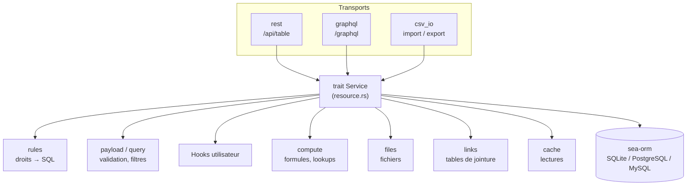
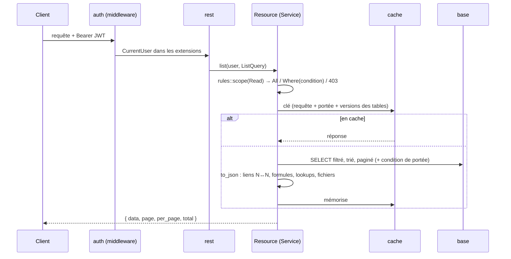

# 4. Runtime du backend : `forge-runtime`

`forge-runtime` contient **tout le comportement** du backend généré. Le projet
généré ne fait que lui déclarer ses entités, ses hooks et ses extensions.

## Démarrage

```rust
// backend/src/main.rs (créé une fois)
#[tokio::main]
async fn main() -> ExitCode {
    forge_runtime::cli::run::<Migrator>(app).await
}
```

`cli::run` lit la configuration (arguments ou variables `DATABASE_URL`,
`FORGE_ADDR`, `FORGE_JWT_SECRET`, `FORGE_CACHE_URL`, `FORGE_UPLOAD_DIR`,
`FORGE_STATIC_DIR`…), se connecte à la base, applique les migrations
(`FORGE_AUTO_MIGRATE`) puis appelle `App::into_router`, qui :

1. vérifie que **chaque table du schéma a sa ressource** et que **chaque
   fonction déclarée est implémentée** (sinon refus de démarrer, avec un
   message clair) ;
2. crée les paramètres, les rôles du schéma et le compte administrateur initial ;
3. assemble le routeur axum : REST de chaque table, GraphQL, OpenAPI + Swagger,
   fichiers, `/health` et `/metrics`, routes personnalisées ;
4. ajoute le middleware d'authentification et la couche d'observabilité.

`App` est un *builder* : `App::new(schéma)` puis `.resource::<Entité, Hooks>()`,
`.function(…)`, `.routes(…)`, `.graphql_query(…)`, `.cache(…)`, `.storage(…)`.
C'est exactement ce qu'appelle `generated/mod.rs` (voir
[Génération](03-generation.md#régénération-sans-perte)).

## L'architecture en couches



Le principe le plus important du runtime : **REST, GraphQL et CSV ne font que
traduire** leur format vers le trait `Service`, qui porte toutes les règles
métier. `Resource<E, H>` implémente `Service` pour chaque entité `E` et ses
hooks `H`. Une règle (validation, droit, calcul) se code donc **une seule
fois**, dans `resource.rs` ou en dessous, et vaut pour les trois transports.

Opérations de `Service` : `list`, `all` (export), `read`, `read_many` (lots
GraphQL), `aggregate`, `create`, `update`, `delete`, `import`.

## Vie d'une requête de lecture

`GET /api/opportunite?etape=gagne&sort=-montant&page=2`



- `query` traduit les paramètres d'URL (filtres typés par colonne, tri,
  pagination, recherche) en requête sea-orm, en validant chaque valeur avec
  `forge_schema::value`.
- `to_json` complète chaque ligne : identifiants des `reference_list`
  (`links`), **formules non stockées et lookups** (`compute::complete`, par
  lots), description des **fichiers** avec URL signée (`files::expand`).
- Un enregistrement hors de la portée de lecture donne **404**, jamais 403 :
  on ne révèle pas son existence.

## Vie d'une écriture

`POST /api/opportunite` (création) : tout se passe **dans une transaction**.

1. `payload::parse` valide le corps : colonnes connues et modifiables, types,
   obligatoires, longueur, contraintes du modèle de champ. Erreurs **par
   champ** (`422`).
2. Portée de création calculée **avant** la transaction (elle peut lire les
   paramètres).
3. `before_create` → `validate` (hooks utilisateur) → `INSERT`.
4. Vérification de la règle sur l'enregistrement tel qu'il a été créé (une
   condition `when` peut porter sur ses valeurs).
5. Liens N↔N, rattachement des fichiers téléversés.
6. **Propagation** : `compute::propagate` recalcule les formules **stockées**
   (`persist`) de cette ligne et de toutes celles qui en dépendent, y compris
   dans d'autres tables (ex. le total d'une entreprise quand on ajoute une
   opportunité).
7. `after_create`, commit.
8. **Après le commit** seulement : invalidation du cache des tables écrites et
   suppression des fichiers remplacés (objet `Written`).

La modification suit le même schéma (droit vérifié avant **et** après) ; la
suppression applique les règles de référence (obligatoire → refus, facultative
→ `NULL`, liens → supprimés).

Pourquoi invalider après le commit ? Si on invalidait avant, une lecture
concurrente pourrait relire l'ancienne valeur et la remettre en cache sous la
nouvelle version.

## Authentification et droits (`auth`, `rules`)

- **Jetons** : accès JWT HS256 court, rafraîchissement aléatoire stocké haché
  et renouvelé à chaque usage. Mots de passe en argon2id.
- **Middleware** : sur tout `/api/` sauf `login` et `refresh`, il place un
  `CurrentUser` (id, e-mail, rôles) dans la requête.
- **Règles** (`rules` du schéma) : pour une table, une action et un
  utilisateur, `rules::scope` renvoie :
  - `Scope::All` : tout est permis ;
  - `Scope::Where(condition)` : la condition `when` (déjà analysée par
    `forge-schema`) est **traduite en SQL** et ajoutée à la requête, par ex.
    `owner = $user.id` ;
  - une erreur `403` si aucun rôle de l'utilisateur ne permet l'action.
- `admin` a tous les droits.

Les conditions `when` sont limitées (colonnes stockées, `$user`, `$param`,
littéraux, opérateurs) précisément pour toujours être traduisibles en SQL : le
filtrage se fait en base, même sur des millions de lignes.

## Formules (`compute`)

| Type de colonne | Quand est-elle calculée ? |
|---|---|
| formule non stockée, lookup | à **chaque lecture**, par lots (`complete`) ; un échec donne `null` et est journalisé |
| formule `persist: true` | à **chaque écriture** qui peut la changer (`propagate`), dans la transaction ; un échec refuse l'écriture |

`compute::graph` charge les lignes voisines par lots (pas une requête par
ligne), `compute::paths` suit les chemins (`entreprise.secteur`,
`opportunites.montant`). Pour savoir quelles lignes recalculer après une
écriture, le runtime remonte les chemins de chaque formule depuis la ligne
modifiée, en regardant son voisinage **avant et après** l'écriture (une
opportunité qui change d'entreprise touche l'ancienne et la nouvelle).

L'évaluation elle-même est faite par `forge-formula` via le trait `Env`.

## Cache des lectures (`cache`)

- Trait `Cache` avec deux implémentations : `MemoryCache` (moka, par défaut)
  et `RedisCache` (feature `redis`, pour plusieurs instances).
- Les clés contiennent la **version** de chaque table dont dépend la réponse
  (calculées par `compute::read_dependencies` : une table lue par un lookup ou
  une formule compte aussi). Une écriture incrémente la version : les anciennes
  clés ne sont plus jamais lues, sans rien avoir à effacer.
- Une erreur de cache ne fait jamais échouer une requête : on lit en base.
- Le cache est actif dans tous les tests : une invalidation oubliée apparaît
  comme une lecture périmée.

## Fichiers (`files`)

- `POST /api/files?table=…&column=…` reçoit le contenu, vérifie le droit
  d'écrire dans la table, la taille et le type (une image est reconnue à son
  contenu, jamais à l'en-tête annoncé), le range via le trait `Storage`
  (`DiskStorage` par défaut) et l'enregistre dans la table système
  `forge_files`.
- L'enregistrement reçoit ensuite l'identifiant ; `files::attach` (dans la
  transaction) vérifie que l'utilisateur en est l'auteur et qu'il n'est pas
  déjà rattaché.
- À la lecture, la colonne devient `{ id, name, size, content_type, url }` ;
  l'URL est **signée** (HMAC) et temporaire, pour fonctionner dans une balise
  `` sans jeton.

## Les autres modules

| Module | Rôle |
|---|---|
| `graphql` | schéma GraphQL **dynamique**, construit au démarrage depuis le `Model` ; un `DataLoader` par requête charge les références par lots |
| `openapi` | document OpenAPI écrit depuis le `Model`, servi avec Swagger UI sur `/docs` |
| `csv_io` | export (filtres de liste appliqués) et import **tout ou rien** : un point de sauvegarde par ligne pour vérifier toutes les lignes, puis rien n'est enregistré à la moindre erreur |
| `aggregate` | `/api/<table>/aggregate` : somme, moyenne, min, max par groupe, en SQL |
| `parameters` | paramètres globaux (`$param.x`) ; un changement recalcule les formules stockées qui les lisent |
| `observability` | journaux (texte ou JSON), identifiant de requête, métriques Prometheus, `/health` |
| `migration` | exécution des `Plan` par base, migrations système (comptes, fichiers) |
| `error` | `Error` → réponse JSON `{ error: { code, message, fields? } }` ; les erreurs internes sont journalisées, jamais exposées |
| `testing` | (feature) `TestDatabase`, `TestClient`, `check_resources`, `check_rules` : utilisés par les tests générés des projets |

## Points d'extension pour le code utilisateur

| Où | Quoi |
|---|---|
| `src/custom/hooks/<table>.rs` | trait `Hooks` : `validate`, `before_create`, `after_create`, `before_update`, `after_update`, `before_delete`. Une erreur annule l'opération (`Error::validation("montant", "doit être positif")`) |
| `src/custom/functions.rs` | implémentation des fonctions de formule déclarées dans `forge.json` |
| `src/custom/graphql.rs` | champs GraphQL supplémentaires |
| `src/custom/routes.rs` | routes axum supplémentaires, avec accès à `AppState` (base, schéma, cache) |

Exemple du CRM (`examples/crm/backend/src/custom/hooks/opportunite.rs`) :

```rust
impl Hooks<Entity> for OpportuniteHooks {
    async fn validate(&self, _ctx: &HookContext<'_>, record: &ActiveModel) -> Result<(), Error> {
        match record.montant.try_as_ref() {
            Some(montant) if *montant <= Decimal::ZERO => Err(Error::validation(
                "montant",
                "le montant doit être strictement positif",
            )),
            _ => Ok(()),
        }
    }
}
```

Un hook qui écrit dans une autre table le signale par `ctx.modified("table")`,
pour que le cache de cette table soit invalidé.

Suite : [5. Interfaces web et Flutter](05-interfaces.md).
