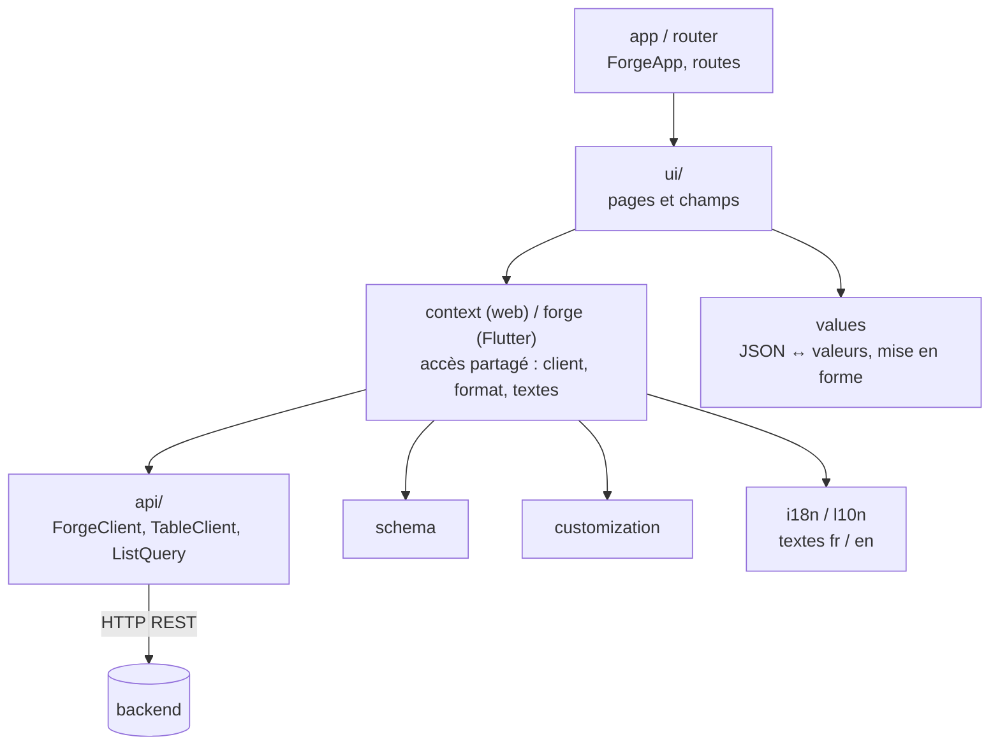

# 5. Interfaces web et Flutter

forge propose deux interfaces, au choix par `app.frontend` dans `forge.json` :

| Valeur | Interface | Bibliothèque |
|---|---|---|
| `"web"` | application React + TypeScript (Vite, composants Mantine) | `packages/forge_web` (`@forge/web`) |
| `"flutter"` (défaut) | application Flutter : web, Android, iOS | `packages/forge_flutter` |
| `["flutter", "web"]` | les deux | les deux |

Les deux bibliothèques ont **le même découpage, les mêmes écrans et la même
identité visuelle**. Ce qui est vrai pour l'une l'est pour l'autre ; seuls les
noms de fichiers changent (`RecordList.tsx` / `record_list.dart`).

## Ce que contient le projet généré

Très peu de code : la description des tables et le branchement.

```text
web/src/                              app/lib/
├── generated/          (réécrit)     ├── generated/          (réécrit)
│   ├── schema.ts                     │   ├── schema.dart     description des tables
│   ├── models.ts                     │   ├── models.dart     types des enregistrements
│   └── app.tsx                       │   └── app.dart        <ForgeApp schema customization>
├── custom/             (à vous)      ├── custom/             (à vous)
│   └── customization.tsx             │   └── customization.dart
└── main.tsx                          └── main.dart
```

- **`schema`** : tables, colonnes (type, options, intitulés par langue),
  relations, règles, vues. L'interface n'interroge pas le serveur pour
  connaître le schéma : il est compilé avec elle.
- **`models`** : un type par table (`interface Entreprise` en TypeScript,
  classe `Entreprise` avec `fromJson`/`toJson` en Dart), pour écrire du code
  personnalisé typé. Les écrans génériques, eux, n'en ont pas besoin.
- **`app`** : `ForgeApp(schema, customization)` ; c'est tout.

## Structure d'une bibliothèque



| Module | Web | Flutter | Rôle |
|---|---|---|---|
| Schéma | `schema.ts` | `schema.dart` | types `AppSchema`, `TableSchema`, `ColumnSchema` et utilitaires (colonnes visibles, intitulé d'une ligne…) |
| API | `api/client.ts`, `api/table.ts`, `api/query.ts` | `api/client.dart`, `api/table_client.dart`, `api/query.dart` | `ForgeClient` : session, renouvellement du jeton sur `401` ; `TableClient<T>` : CRUD d'une table ; `ListQuery` : filtres, tri, pages |
| Valeurs | `values.ts` | `values.dart` | conversion JSON ↔ dates, décimaux (en texte, sans perte), durées ; `ValueFormat` : affichage selon la langue ; raccourcis de date |
| Contexte | `context.tsx` (`useForge()`) | `forge.dart` (`Forge.of(context)`) | ce que tous les écrans partagent : client, schéma, format, textes, personnalisation |
| Chargement | `hooks.ts` (`useAsync`) | `DataChanges` | web : chaque page recharge ses données quand elle s'affiche ; Flutter : après une écriture, toutes les pages ouvertes (empilées) se rechargent. Dans les deux cas, on ne réaffiche jamais une valeur périmée (une écriture peut changer des formules d'autres tables) |
| Intitulés | `titles.ts` | `TitleCache` | intitulés des références, chargés par lots et mis en cache |
| Routes | `paths.ts`, `app.tsx` | `router.dart` (`Paths`) | `/`, `/data/:table`, `/data/:table/:id`, `/data/:table/:id/edit`, `/data/:table/new`, `/settings/…`, `/pages/:page` |
| Écrans | `ui/*.tsx` | `ui/*.dart` | voir ci-dessous |
| Textes | `i18n.ts` | `l10n/strings.dart` | `ForgeStrings`, français et anglais |
| Apparence | `theme.ts`, `palette.ts` | `theme.dart`, `palette.dart` | dégradé indigo → violet, couleurs des valeurs d'énumération |
| Tests | `testing.ts` | `testing.dart` | `FakeApi` : un faux backend en mémoire pour tester les écrans |

### Les écrans (`ui/`)

| Écran | Fichiers | Ce qu'il fait |
|---|---|---|
| Accueil | `HomePage` / `home_page` | tableau de bord : compte par table, répartitions des vues `stats`, prochaines échéances des vues `calendar` |
| Table | `TablePage`, `RecordList`, `filters`, `StatsPanel`, `CalendarPanel`, `csv` | liste paginée, recherche, tri, filtres typés, onglets statistiques et calendrier, export / import CSV |
| Fiche | `DetailPage` / `detail_page` | valeurs mises en forme, références cliquables, listes des enregistrements liés |
| Formulaire | `FormPage`, `fields`, `models`, `ReferenceSelect`, `CreateRecord` | un champ par type de colonne ; seules les colonnes modifiées sont envoyées ; erreurs du serveur sous chaque champ |
| Comptes | `LoginPage`, `AccountPage`, `UsersPage`, `ParametersPage` | connexion, mot de passe, comptes et rôles, paramètres |
| Cadre | `Shell` / `shell` | menu, en-tête, thème clair / sombre, adaptation au téléphone |

`fields` choisit le champ selon le type de la colonne ; les modèles de champ
(couleur, note, fichier, Markdown…) sont dans `ui/models.tsx` /
`ui/field_models.dart`.

## Comment un écran trouve ce qu'il affiche

Rien n'est écrit table par table : tout est déduit du schéma. Par exemple, la
fiche d'une opportunité :

1. la route `/data/opportunite/1` donne la table et l'identifiant ;
2. `schema` donne les colonnes visibles, leur type et leur intitulé ;
3. `TableClient.read(1)` charge l'enregistrement (formules déjà calculées par le
   serveur) ;
4. `ValueFormat` met chaque valeur en forme selon son type et la langue ;
5. les relations du schéma donnent les listes « enregistrements liés » à
   afficher sous la fiche ;
6. les règles du schéma masquent les boutons que l'utilisateur ne peut pas
   utiliser (le serveur vérifie de toute façon).

## Personnaliser sans toucher au code généré

`custom/customization.tsx` (ou `.dart`) déclare un objet
`ForgeCustomization` :

| Clé | Effet |
|---|---|
| `theme` | thème Mantine / Material (couleur principale, police…) |
| `tableIcons` | icône de chaque table dans le menu |
| `enumLabels` | intitulés des valeurs d'énumération, par langue |
| `fields` | champ de formulaire remplacé pour une colonne (`'table.colonne'`) |
| `cells` | affichage remplacé pour une colonne |
| `detailSections` | blocs ajoutés à la fiche d'une table |
| `pages` | pages ajoutées au menu (avec rôles autorisés) |
| `strings` | textes modifiés, ou langue supplémentaire |

Exemple du CRM :

```tsx
export const customization: ForgeCustomization = {
  theme: { primaryColor: 'indigo' },
  tableIcons: { entreprise: IconBuilding, opportunite: IconTrendingUp },
  enumLabels: {
    'opportunite.etape': { gagne: { fr: 'Gagnée', en: 'Won' } },
  },
  detailSections: { entreprise: [EntrepriseSummary] },
};
```

Comme le code généré importe ce fichier, ajouter une table au schéma ne le
modifie jamais.

## Comment le projet utilise la bibliothèque

Le projet dépend de la bibliothèque **par chemin** (écrit par `forge generate`
dans `package.json` / `pubspec.yaml`) :

- **Web** : `@forge/web` est lu **en sources TypeScript**, sans étape de
  compilation. Vite (`preserveSymlinks`, `dedupe`) et vitest
  (`server.deps.inline`) sont configurés pour qu'il n'y ait qu'un seul React et
  un seul Mantine : ceux du projet.
- **Flutter** : dépendance `path:` classique.

Pour le déploiement, `scripts/use-forge.sh` repointe ces chemins vers les
sources de forge copiées dans l'image Docker.

Suite : [6. Contribuer](06-contribuer.md).
